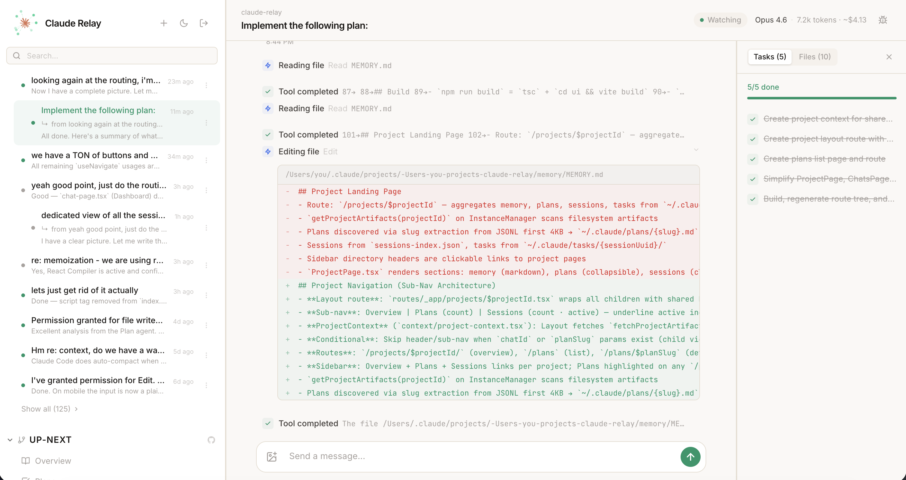

# Claude Relay

A lightweight bridge between remote devices and your local [Claude Code](https://docs.anthropic.com/en/docs/claude-code) CLI. Run it on your dev machine, connect from your phone or laptop, and chat with Claude Code from anywhere.

Claude Relay also automatically discovers other Claude Code sessions running on your machine and lets you monitor or resume them from the web UI.

> **Fair warning:** This project is held together with duct tape and optimism. It relies on Claude Code's undocumented JSONL transcript format, its `stream-json` output mode, the layout of `~/.claude/`, and various CLI flags that could change without notice. Any Claude Code update could break things in spectacular and unexpected ways. There is no stable API contract here — just a guy reading JSONL files and hoping for the best. If it works today, celebrate. If it breaks tomorrow, that's expected.



## How It Works

```
                          YOUR DEV MACHINE
  ┌──────────────────────────────────────────────────────────────┐
  │                                                              │
  │   Terminal sessions           Claude Relay                   │
  │  ┌──────────────────┐       ┌──────────────────────────┐     │
  │  │ $ claude          │──┐   │                          │     │
  │  │ $ claude          │──┤   │  InstanceManager         │     │
  │  │ $ claude          │──┘   │    ┌───────────────────┐ │     │
  │  └──────────────────┘  ▲    │    │ ClaudeProcess ×N  │ │     │
  │     discovered via     │    │    └───────────────────┘ │     │
  │     ps + JSONL watch ──┘    │                          │     │
  │                             │  HTTP   ─── REST API     │     │
  │                             │  WebSocket ─ streaming   │     │
  │                             │  Auth   ─── sessions     │     │
  │                             │  UI     ─── React SPA    │     │
  │                             └──────┬─────────┬─────────┘     │
  │                                    │         │               │
  │                     ┌──────────────┴┐  ┌─────┴────────────┐  │
  │                     │  Tailscale    │  │  cloudflared      │  │
  │                     │  (tailnet)    │  │  (public tunnel)  │  │
  │                     └──────────────┬┘  └─────┬────────────┘  │
  └────────────────────────────────────┼─────────┼───────────────┘
                                       │         │
                                 tailnet mesh   HTTPS tunnel
                                       │         │
                              ┌────────┴─┐  ┌────┴─────┐
                              │  Phone   │  │  Laptop  │
                              └──────────┘  └──────────┘
```

1. **Claude Relay** runs on your dev machine alongside Claude Code
2. **InstanceManager** spawns and manages Claude Code processes (`claude -p --output-format stream-json`)
3. **Session discovery** finds Claude Code instances you started in the terminal and streams their JSONL transcripts
4. **WebSocket** streams output, activity, and status changes to subscribed browser clients
5. **Tailscale** (optional) makes the relay reachable from any device on your private tailnet
6. **Cloudflare Tunnel** (optional) gives you a public HTTPS URL for access from any device

## Projects and Directories

Claude Relay inherits Claude Code's project model: **the directory you launch `claude` from is your project**. The CLI loads `CLAUDE.md` from the working directory, project memory is keyed by it, and JSONL transcripts are stored under `~/.claude/projects/` using the encoded path. Relay uses the same convention — sessions are grouped by their starting directory in the sidebar, project pages aggregate artifacts by directory, and external session discovery reads the `cwd` from each session's JSONL init entry.

This is a convention, not a constraint. Nothing prevents a session started in `~/projects/foo` from editing files in `~/projects/bar` or running commands elsewhere. The working directory is a "home base," not a sandbox — the same way a git repo doesn't stop you from touching files outside it. In practice the heuristic is correct the vast majority of the time, since people launch `claude` from the repo they're working on.

New managed sessions run directly in the directory you choose. If Relay discovers or restores a session that already lives in a Relay-managed git worktree, it preserves that worktree metadata so the session can still be resumed, displayed, and merged correctly.

## What It Does

- **Multi-session management** — run multiple Claude Code instances side-by-side, each with its own working directory and conversation history
- **External session discovery** — automatically detects Claude Code sessions started from your terminal and streams their output in real time
- **Resume external sessions** — take over a terminal-started session from the web UI, then switch freely between terminal and UI on the same conversation (one at a time)
- **Per-session controls** — choose a model override and reasoning effort from the chat input for managed sessions
- **Slash commands in the composer** — use `/model ...` and `/reasoning ...` from the inline command palette to adjust those settings without sending a chat message
- **`@` file and folder tagging** — type `@` in the composer to search the current workspace, insert tagged paths as inline chips, and send them to Codex as raw `@path/to/file` references
- **Interactive tool responses** — when Claude asks a question (`AskUserQuestion`), click an option in the UI to respond directly; the answer is sent as a follow-up message
- **Mobile-friendly web UI** — React SPA with markdown rendering, syntax highlighting, activity indicators, directory browsing, and modern framework-aware file icons in the sidecar
- **Remote access** — built-in Cloudflare Tunnel support for secure access from anywhere
- **Embeddable** — use as a standalone server or import the core library into your own app

## What It Doesn't Do

- **No model access** — this is not an API wrapper. It shells out to the `claude` CLI binary on your machine. You need Claude Code installed.
- **No multi-user auth** — single password protects the whole server. There are no user accounts or per-user permissions.
- **No multi-device sync** — persistence is local to the machine running the relay.

## Quick Start

```bash
npm install
npm run build
RELAY_PASSWORD="your-secret" npm start
```

Open `http://localhost:7777`. That's it.

### Setting a Password

The `RELAY_PASSWORD` environment variable is required. You can set it in a few ways:

```bash
# Inline (simplest — good for one-off launches)
RELAY_PASSWORD="your-secret" npm start

# Export it for the current shell session
export RELAY_PASSWORD="your-secret"
npm start

# Or put it in a .env file (not committed to git)
echo 'RELAY_PASSWORD=your-secret' > .env
source .env && npm start
```

The password protects the web UI — you'll enter it once on the login page, then a session cookie keeps you authenticated for 7 days.

### Remote Access

**Option A: Tailscale (recommended for personal use)**

If you run [Tailscale](https://tailscale.com) on your devices, the relay is already accessible — no tunnel needed. Just start it and connect from any device on your tailnet:

```bash
RELAY_PASSWORD="your-secret" npm start
# → http://your-machine:7777 from any tailnet device
```

Tailscale authenticates at the network layer, so only your devices can reach the relay. The password still protects the web UI as a second factor.

**Option B: Cloudflare Tunnel (for public URLs)**

```bash
# Built-in tunnel (requires cloudflared)
TUNNEL=true RELAY_PASSWORD="your-secret" npm start

# Or manually
cloudflared tunnel --url http://localhost:7777
```

This gives you a public `https://*.trycloudflare.com` URL you can open on any device — useful when you need to share access or can't install Tailscale.

## Architecture

```
src/
  core/                 ← "claude-relay" (no server deps)
    claude-process.ts      Spawns claude -p processes, parses stream-json
    providers/claude-sdk.ts Long-lived SDK-backed provider session
    instance-manager.ts    Manages multiple instances + discovers external sessions
    workspace-entries.ts   Workspace file/folder indexing for `@` mention search
    config.ts              CoreConfig type + resolveCoreConfig()
    types.ts               All shared type definitions
    logger.ts              Logger interface
    tools.ts               Tool description helpers
    index.ts               Barrel export
  server/               ← "claude-relay/server" (extends core)
    http.ts                REST API + static file serving
    websocket.ts           Real-time message relay via subscriptions
    auth.ts                Password auth + session cookies + rate limiting
    tunnel.ts              Cloudflare Tunnel lifecycle
    config.ts              RelayConfig extends CoreConfig
    index.ts               ClaudeRelay class, createRelay(), re-exports core
  bin.ts                ← CLI entry point
ui/                     ← React app
  src/components/chat/composer-editor.tsx
  src/components/ui/file-icon.tsx
  src/lib/composer-mentions.ts
  src/lib/file-icons.ts
```

The package exposes two entry points:

```ts
// Core only — embed process management in your own app
import { InstanceManager, ClaudeProcess } from "claude-relay";

// Full server — HTTP + WebSocket + auth + UI
import { createRelay } from "claude-relay/server";
```

The server entry point re-exports everything from core, so you never need to import from both.

## Library Usage

### Full Server

```ts
import { createRelay } from "claude-relay/server";

const relay = createRelay({
  password: "my-secret",
  port: 8080,
  workingDirectory: "/path/to/project",
});

await relay.start();
// → http://localhost:8080

await relay.stop();
```

### Core Only

```ts
import { InstanceManager, resolveCoreConfig } from "claude-relay";

const config = resolveCoreConfig({
  workingDirectory: "/my/project",
  maxProcesses: 5,
});

const manager = new InstanceManager(config);
const instance = manager.createInstance({ name: "My Session" });

manager.on("instance:output", (id, message) => {
  console.log(message.text);
});

manager.sendMessage(instance.id, "Hello Claude");
```

## Configuration

### Environment Variables (CLI)

| Variable                     | Default                          | Description                                                   |
| ---------------------------- | -------------------------------- | ------------------------------------------------------------- |
| `RELAY_PASSWORD`             | **(required)**                   | Authentication password                                       |
| `PORT`                       | `7777`                           | Server port                                                   |
| `WORKING_DIR`                | `$HOME`                          | Default working directory for Claude                          |
| `MAX_PROCESSES`              | `15`                             | Maximum concurrent managed processes                          |
| `TUNNEL`                     | `false`                          | Set `"true"` to start a Cloudflare Tunnel                     |
| `DANGEROUS_SKIP_PERMISSIONS` | `false`                          | Set `"true"` to skip Claude's permission prompts              |
| `PROCESS_TIMEOUT`            | `300000`                         | Process timeout in ms (5 min)                                 |
| `SESSION_MAX_AGE`            | `604800000`                      | Session lifetime in ms (7 days)                               |
| `SESSION_FILE`               | `~/.claude-relay/sessions.json`  | Session persistence file path                                 |
| `MANIFEST_FILE`              | `~/.claude-relay/instances.json` | Instance manifest file path (for persistence across restarts) |

### Programmatic Options

| Option                       | Type      | Default                          | Description                                    |
| ---------------------------- | --------- | -------------------------------- | ---------------------------------------------- |
| `password`                   | `string`  | **(required)**                   | Authentication password                        |
| `port`                       | `number`  | `7777`                           | Server port                                    |
| `workingDirectory`           | `string`  | `process.cwd()`                  | Default working directory                      |
| `maxProcesses`               | `number`  | `15`                             | Max concurrent managed processes               |
| `dangerouslySkipPermissions` | `boolean` | `false`                          | Skip Claude's permission prompts               |
| `processTimeout`             | `number`  | `300000`                         | Process timeout in ms                          |
| `serveUI`                    | `boolean` | `true`                           | Serve the built-in web UI                      |
| `sessionMaxAge`              | `number`  | `604800000`                      | Session lifetime in ms                         |
| `rateLimitMax`               | `number`  | `5`                              | Max login attempts per IP per window           |
| `rateLimitWindow`            | `number`  | `60000`                          | Rate limit window in ms                        |
| `manifestFile`               | `string`  | `~/.claude-relay/instances.json` | Instance manifest file for restart persistence |
| `logger`                     | `Logger`  | `console`                        | Custom logger implementation                   |

## Security

- **No default password** — the server refuses to start without `RELAY_PASSWORD`
- **Rate limiting** — login attempts are throttled per IP (5/min default)
- **Safe by default** — `dangerouslySkipPermissions` is off unless you opt in
- **HttpOnly cookies** — session tokens are not accessible to JavaScript
- **SameSite=strict** — cookies are not sent on cross-origin requests
- Designed to run behind Cloudflare Tunnel (HTTPS) for remote access

## Development

```bash
# Watch mode — rebuilds server, TypeScript, and UI on changes
npm run dev

# Run tests
npm test

# Build everything
npm run build
```

## Prerequisites

- Node.js 20+
- [Claude Code CLI](https://docs.anthropic.com/en/docs/claude-code) installed and authenticated
- [Tailscale](https://tailscale.com) (optional, for private remote access) or [cloudflared](https://developers.cloudflare.com/cloudflare-one/connections/connect-networks/downloads/) (optional, for public tunnel access)
