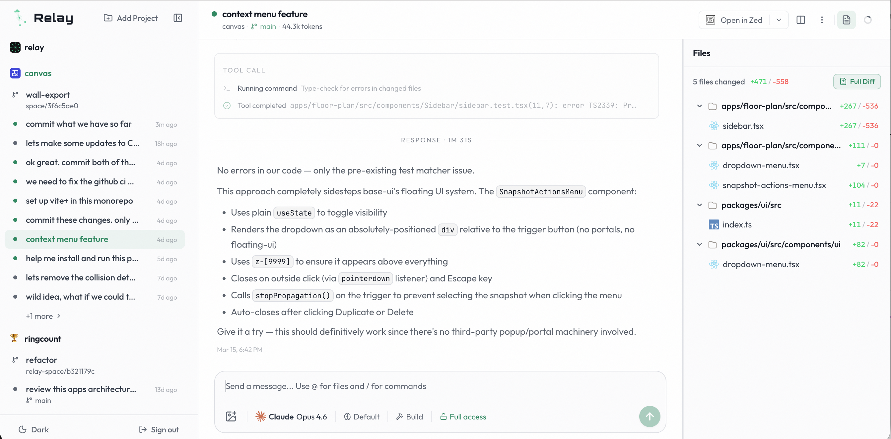
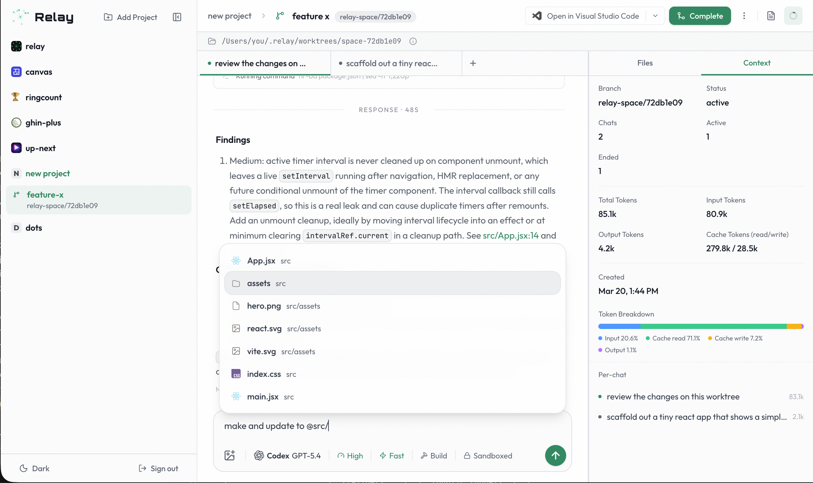

# Relay

A remote control center for your local AI coding agents. Run Relay on your dev machine, open it locally or from an external device, and manage Claude Code or Codex sessions from anywhere.

Relay discovers sessions already running on your machine, lets you resume them from the browser, and gives you a cleaner way to manage multiple chats, projects, and git worktrees in one place.

- Monitor local Claude Code and Codex sessions from anywhere
- Resume terminal-started chats from the web UI
- Switch branches, manage worktrees, and keep project context organized
- Use it privately over Tailscale or expose it through a tunnel when needed

### Chats



### Spaces (git worktrees)



## Quick Start

### Install

If you want to run Relay, clone the repo, build it once, and install the CLI globally from the checked-out directory:

```bash
git clone git@github.com:ehermanson/relay.git
cd relay
pnpm install
pnpm build
npm install -g .
```

Then you can run it from anywhere:

```bash
relay start
```

Open `http://localhost:7777`. That's it.

Notes:

- `npm install -g relay` is not the right command here; the bare `relay` package name on npm is already taken
- The global install above uses the CLI from your local checkout after `pnpm build`
- After pulling updates, rebuild and reinstall globally: `pnpm build && npm install -g .`

### Run Without Installing Globally

If you prefer not to install the CLI globally, you can still run Relay directly from the repo:

```bash
pnpm install
pnpm build
pnpm start
```

### Setting a Password

Relay can run in open mode with no login, or with a single shared password for the web UI.

```bash
# Open mode (local-only / trusted network)
relay start

# Password via CLI flag
relay start --password "your-secret"

# Password via env var
export RELAY_PASSWORD="your-secret"
relay start

# Or use a .env file (not committed to git)
echo 'RELAY_PASSWORD=your-secret' > .env
source .env && relay start
```

When a password is configured, the web UI shows a login page and then keeps you authenticated with a session cookie for 7 days.

If you are running from the repo without a global install, use the same flags through `pnpm start`:

```bash
pnpm start -- --password "your-secret"
pnpm start -- --port 8888
pnpm start -- --tunnel --password "your-secret"
```

### Remote Access

**Option A: Tailscale (recommended for personal use)**

If you run [Tailscale](https://tailscale.com) on your devices, the relay is already accessible:

```bash
relay start --password "your-secret"
# -> http://your-machine:7777 from any tailnet device
```

**Option B: Cloudflare Tunnel (for public URLs)**

```bash
# Built-in tunnel (requires cloudflared)
relay start --tunnel --password "your-secret"

# Or manually
cloudflared tunnel --url http://localhost:7777
```

If you use `--tunnel`, set a password. Open mode plus a public tunnel exposes the full Relay UI to anyone with the URL.

## Core Features

- **Multi-session management** — run multiple agent instances side-by-side, each with its own working directory and conversation history
- **Multi-provider support** — managed sessions for Claude and Codex, with a provider picker in the UI
- **External session discovery** — automatically detects agent sessions running in terminals and streams their output in real time
- **Resume external sessions** — take over a terminal-started session from the web UI
- **Per-session controls** — model picker, reasoning effort, and build/plan mode toggle, driven by provider capabilities
- **Provider handoff** — switch providers mid-project, optionally carrying recent context into the new session
- **Interactive tool responses** — when the agent asks a question or requests approval, the composer becomes an answer form
- **Slash commands** — `/model` and `/reasoning` from the composer command palette
- **`@` file mentions** — workspace search with inline mention chips
- **Lazy hydration** — sidebar renders instantly from cached metadata; full transcript replay happens when you open a session
- **Git integration** — branch switching, push/pull/fetch from the UI, ahead/behind indicators, and space push with optional PR creation via `gh` CLI
- **Project settings** — per-project custom instructions, default space branch, and default provider/model
- **Git worktree support** — sessions in relay-managed worktrees can be merged back to main from the sidebar
- **Remote access** — built-in Cloudflare Tunnel support, or use Tailscale for private access

## How It Works

```
                          YOUR DEV MACHINE
  ┌──────────────────────────────────────────────────────────────┐
  │                                                              │
  │   Terminal sessions           Relay                          │
  │  ┌──────────────────┐       ┌──────────────────────────┐     │
  │  │ $ claude          │──┐   │                          │     │
  │  │ $ claude          │──┤   │  InstanceManager         │     │
  │  │ $ codex           │──┘   │    ┌───────────────────┐ │     │
  │  └──────────────────┘  ▲    │    │ ProviderSession ×N│ │     │
  │     discovered via     │    │    └───────────────────┘ │     │
  │     ps + JSONL watch ──┘    │                          │     │
  │                             │  HTTP   ─── REST API     │     │
  │                             │  WebSocket ─ streaming   │     │
  │                             │  Auth   ─── sessions     │     │
  │                             │  UI     ─── React SPA    │     │
  │                             └──────┬─────────┬─────────┘     │
  │                                    │         │               │
  │                     ┌──────────────┴┐  ┌─────┴────────────┐  │
  │                     │  Tailscale    │  │  cloudflared      │  │
  │                     │  (tailnet)    │  │  (public tunnel)  │  │
  │                     └──────────────┬┘  └─────┬────────────┘  │
  └────────────────────────────────────┼─────────┼───────────────┘
                                       │         │
                                 tailnet mesh   HTTPS tunnel
                                       │         │
                              ┌────────┴─┐  ┌────┴─────┐
                              │  Phone   │  │  Laptop  │
                              └──────────┘  └──────────┘
```

1. **Relay** runs on your dev machine alongside your coding agents
2. **InstanceManager** spawns and manages provider-backed sessions through the provider-driver registry
3. **Session discovery** finds agent sessions running in terminals and streams their transcripts
4. **WebSocket** streams output, activity, and status changes to subscribed browser clients
5. **Tailscale** (optional) makes the relay reachable from any device on your private tailnet
6. **Cloudflare Tunnel** (optional) gives you a public HTTPS URL for access from any device

### Provider Registry

Relay's backend is organized around a **provider-driver registry**. Each provider declares its capabilities and owns its own session lifecycle behind a shared contract:

```
  ┌─────────────────────────────────────────────────────────────────────┐
  │                        Provider Registry                            │
  │                                                                     │
  │  ┌─────────────┐   ┌─────────────┐                                 │
  │  │  Claude      │   │  Codex      │  ← Drivers                     │
  │  │  SDK / CLI   │   │  app-server │                                 │
  │  └──────┬───────┘   └──────┬──────┘                                 │
  │         │                  │                                        │
  │         ▼                  ▼                                        │
  │  ┌──────────────────────────────────────────────────────────┐       │
  │  │              ProviderSession contract                    │       │
  │  │  send() · interrupt() · close() · setModel()            │       │
  │  │  setReasoningBudget() · setPlanMode()                    │       │
  │  │  getRuntimeBinding() · respondToRequest()                │       │
  │  └──────────────────────────────────────────────────────────┘       │
  │         │                                                           │
  │         ▼                                                           │
  │  ┌──────────────────────────────────────────────────────────┐       │
  │  │              ProviderCapabilities                        │       │
  │  │  supportsResume · supportsApprovals · supportsPlanMode   │       │
  │  │  supportsReasoningBudget · supportsModelSelection · ...  │       │
  │  └──────────────────────────────────────────────────────────┘       │
  └─────────────────────────────────────────────────────────────────────┘
```

Each driver implements: `isAvailable()`, `createSession()`, `getModels()`, `parseTranscript()`, `resolveManagedTranscriptPath()`, and `captureManagedSession()`. The UI never hardcodes provider-specific logic — it queries `GET /api/providers` for available providers and `GET /api/provider-models?provider=...` for model lists and capabilities, then shows or hides controls accordingly.

### Data Flow

```
  ┌────────────┐
  │  React UI  │
  │  (Vite)    │
  └─────┬──────┘
        │ WebSocket (JSON)
        ▼
  ┌────────────────┐     subscribe/unsubscribe per instance
  │  WS Server     │───► broadcast: status, create, remove → all clients
  │                │───► scoped: output, activity, exit → subscribers only
  └─────┬──────────┘
        │
        ▼
  ┌────────────────────────────────────────────────────────────┐
  │                    InstanceManager                          │
  │                                                            │
  │  instances: Map<id, Instance>                              │
  │                                                            │
  │  ┌──────────────────┐   ┌──────────────────┐               │
  │  │  Managed          │   │  External         │              │
  │  │  ProviderSession  │   │  JSONL watcher    │              │
  │  │  (live process)   │   │  (2s poll)        │              │
  │  └────────┬─────────┘   └────────┬──────────┘              │
  │           │                      │                          │
  │           ▼                      ▼                          │
  │  ┌─────────────────────────────────────────────────┐       │
  │  │  Unified event stream                           │       │
  │  │  output · activity · stats · exit               │       │
  │  └─────────────────────────────────────────────────┘       │
  │           │                                                 │
  │           ▼                                                 │
  │  ┌─────────────────────────────────────────────────┐       │
  │  │  SessionDB (SQLite)                             │       │
  │  │  sessions: rebuildable transcript index         │       │
  │  │  managed_sessions: provider runtime bindings    │       │
  │  └─────────────────────────────────────────────────┘       │
  └────────────────────────────────────────────────────────────┘
```

### Session Lifecycle

```
  New chat request
        │
        ▼
  ┌──────────────┐    Provider registry picks driver
  │ createSession│───► driver.createSession()
  └──────┬───────┘    returns ProviderSession
         │
         ▼
  ┌──────────────┐    First response arrives
  │ Capture      │───► extract session ID + transcript path
  │ session ID   │    persist runtime binding to SQLite
  └──────┬───────┘
         │
         ▼
  ┌──────────────┐    User sends messages
  │ Active       │───► provider session handles send/resume
  │              │    transcript watcher tracks changes
  └──────┬───────┘
         │
         ▼
  ┌──────────────┐    Relay restarts
  │ Persisted    │───► SQLite has runtime binding
  │ (stopped)    │    sidebar renders from cached metadata
  └──────┬───────┘
         │
         ▼
  ┌──────────────┐    User opens the session
  │ Lazy hydrate │───► replay transcript, restore state
  │              │    boot provider session if resumable
  └──────────────┘
```

### External Session Discovery

```
  Every 10 seconds:
  ┌──────────────┐
  │ ps -eo pid   │───► find agent CLI processes
  └──────┬───────┘     (exclude managed PIDs)
         │
         ▼
  ┌──────────────┐
  │ lsof -p PID  │───► resolve working directory
  └──────┬───────┘
         │
         ▼
  ┌──────────────┐
  │ Match trans- │───► provider-specific transcript paths
  │ cript files  │    (e.g. ~/.claude/projects/, ~/.codex/sessions/)
  └──────┬───────┘
         │
         ▼
  ┌──────────────┐
  │ Start watch  │───► 2s poll, emit new entries
  └──────┬───────┘
         │
         ▼
  ┌──────────────┐     User sends message from UI
  │ Resume       │───► stop external process
  │ (optional)   │    spawn managed provider session
  └──────────────┘
```

## Projects and Directories

Relay organizes work around explicitly registered git projects. A project is opt-in: once you add a repo, Relay discovers sessions for that repo, groups chats under that project in the sidebar, and aggregates project artifacts (plans, memory, docs) on the project page.

Sessions still carry a working directory, and that directory remains the agent's "home base," not a sandbox. Nothing prevents a session started in `~/projects/foo` from editing files in `~/projects/bar`. But visibility and discovery now key off registered projects, with Relay normalizing registrations to the repo root.

## Limits

- **No model access** — this is not an API wrapper. It manages provider CLIs and SDKs on your machine. You need at least one provider installed.
- **No multi-user auth** — optional single-password auth protects the whole server when enabled.
- **No multi-device sync** — persistence is local to the machine running the relay (though importing/exporting is supported, see below).

### Export / Import

Relay still does not have true multi-device sync, but it can now export a local migration bundle and import it on another machine.

```bash
# Create a directory bundle with a DB snapshot + Claude/Codex JSONL transcripts
relay export ~/relay-export

# Merge that bundle into another install
relay import ~/relay-export

# Or create/import a single tarball
relay export-tgz ~/relay-export.tgz
relay import-tgz ~/relay-export.tgz

# Or from this repo without installing globally
pnpm relay:export -- ~/relay-export
pnpm relay:import -- ~/relay-export
pnpm relay:export-tgz -- ~/relay-export.tgz
pnpm relay:import-tgz -- ~/relay-export.tgz
```

Notes:

- `export` / `import` use a directory bundle
- `export-tgz` / `import-tgz` wrap the same bundle format in a single `.tgz` archive
- `import` merges transcript trees into local `~/.claude/projects` and `~/.codex/sessions`
- Relay rewrites transcript paths in imported DB rows to the new machine's local provider dirs
- Project/worktree paths are best-effort; if your repos live in different places, you may need to re-register or clean up a few entries after import

## Configuration

### Environment Variables

| Variable          | Default                  | Description                                |
| ----------------- | ------------------------ | ------------------------------------------ |
| `RELAY_PASSWORD`  | unset                    | Authentication password; unset = open mode |
| `PORT`            | `7777`                   | Server port                                |
| `WORKING_DIR`     | `process.cwd()`          | Default working directory                  |
| `MAX_PROCESSES`   | `15`                     | Maximum concurrent managed processes       |
| `TUNNEL`          | `false`                  | Start a Cloudflare Tunnel                  |
| `PROCESS_TIMEOUT` | `300000`                 | Process timeout in ms (5 min)              |
| `SESSION_MAX_AGE` | `604800000`              | Auth session lifetime in ms (7 days)       |
| `SESSION_FILE`    | `~/.relay/sessions.json` | Auth session persistence file              |
| `DB_PATH`         | `~/.relay/sessions.db`   | Relay SQLite database path                 |
| `CLAUDE_DIR`      | `~/.claude`              | Claude data directory                      |
| `CODEX_DIR`       | `~/.codex`               | Codex data directory                       |

## Development

### For Contributors

Contributor workflow stays repo-local; you do not need a global install for development.

```bash
pnpm install
pnpm dev    # Watch mode — rebuilds server + UI on changes
pnpm build:server
pnpm test   # Tests import from dist/, so build server first
pnpm typecheck  # Run server + UI TypeScript checks
pnpm build  # Build everything
```

Useful repo-local CLI commands:

```bash
pnpm start -- --password "your-secret"
pnpm start -- --port 8888
pnpm relay:export -- ~/relay-export
pnpm relay:import -- ~/relay-export
```

## Prerequisites

- Node.js 22+
- At least one supported provider installed and authenticated:
  - [Claude Code](https://docs.anthropic.com/en/docs/claude-code)
  - [Codex](https://github.com/openai/codex) (`npm install -g @openai/codex`)
- [Tailscale](https://tailscale.com) (optional) or [cloudflared](https://developers.cloudflare.com/cloudflare-one/connections/connect-networks/downloads/) (optional) for remote access
